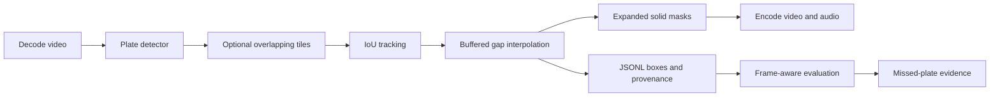

# License Plate Video Anonymizer

A Python video pipeline that detects vehicle plates, links detections across frames,
recovers short gaps, and burns redactions into the output video.

**Working engineering baseline.** A 30-second street clip has been processed and
checked end to end. **99% recall / 95% precision are acceptance targets, not measured
results.** The included evaluation workflow makes those targets testable on labelled footage.

## Pipeline



- Plate-specific YOLO adapter; rejects generic object detectors without plate classes.
- Full-frame, tiled, and hybrid inference; coordinates remain in the original image.
- Bounded frame buffering, short-gap recovery, configurable padding and redaction.
- JSONL with detection boxes, actual mask rectangles, confidence, track ID and source.
- Evaluation by frame, per-condition recall, false-negative crops and input checksums.
- CLI progress, CPU support, optional CUDA, and an explicit throughput/cost calculator.

## Quick start

Python 3.11+. From a clone of this repository:

```bash
python -m venv .venv
# Windows: .venv\Scripts\activate
# Linux/macOS: source .venv/bin/activate
python -m pip install -e ".[dev,yolo,media]"
python scripts/download_model.py
plate-anonymizer anonymize --input input/clip.mp4 --output output/redacted.mp4 --model models/plate_detector.pt --device cpu --image-size 1280 --redaction solid --preserve-audio
```

The downloader verifies a recorded SHA256. Supply your own plate checkpoint with
`--model` if preferred. For unusual plate labels, use `--plate-class-id N`.
On Windows, `.\run.cmd "C:\videos\clip.mp4"` is a shortcut after installation.
See [setup and reproducibility](docs/SETUP.md).

The MP4 audio-preserving path produces H.264/AAC. Solid masks are recommended for
privacy; blur and pixelation are also available. Processing stays local.
Decoded resolution and nominal FPS are retained for the tested constant-FPS input.

## Measured demonstration

| Item | Observed result |
| --- | --- |
| Street video | 750 frames, 1280 × 720, 25 FPS, 30 seconds |
| CPU processing | 371.81 seconds; approximately 2.02 FPS |
| Model observations | 1,538 detections plus 7 interpolated boxes |
| Output verification | All 750 frames decode; H.264 video and AAC audio |
| Accuracy / GPU throughput | Not measured |

The timing excludes model loading and the separate final H.264/audio pass.
Detection counts are not unique vehicles or verified true positives. A background
false positive was visible during review. [Full demo report](docs/DEMO_RESULTS.md).

## Reproduce an evaluation

Run the included **synthetic format example** without downloading a model:

```bash
plate-anonymizer evaluate-video --predictions examples/predictions.jsonl --ground-truth examples/ground_truth.json --report evaluation_results/example.json
```

Expected: **1 TP, 1 FP, 1 FN**. This tests the evaluator, not model quality.

For actual footage, label the reviewed frames using the
[annotation format](docs/ANNOTATION_GUIDE.md), then evaluate pipeline JSONL:

```bash
plate-anonymizer evaluate-video --predictions output/redacted.jsonl --ground-truth data/clip_gt.json --report evaluation_results/coverage.json --metric coverage --threshold 0.95 --box-field redaction_bbox --video input/clip.mp4 --failure-dir evaluation_results/missed
```

[Evaluation protocol](docs/EVALUATION_PROTOCOL.md) explains dataset size, held-out
testing, difficult cases, and the evidence needed for a 99% recall claim.

## Tests

```bash
python -m ruff check .
python -m pytest
```

GitHub Actions is configured for Python 3.11/3.13 on Windows and Linux.
Local test success does not imply a hosted CI run has already passed.

## Scope and next steps

This baseline has not been validated on 4K, night footage, H.265/MOV inputs or
hour-long recordings. Variable-frame-rate timing, HDR preservation, scene-cut
handling, resume/retry, stronger tracking and model fine-tuning remain open.
Interpolation needs detections on both sides; it cannot recover a plate never
detected. See [architecture and limitations](docs/ARCHITECTURE.md) and the
[production plan](docs/PROJECT_PLAN.md).

Source: [MIT](LICENSE). Downloaded weights and Ultralytics retain their own terms;
see [model provenance](models/README.md) and [licensing notes](docs/MODELS_AND_LICENSES.md).
Footage, local results and weights are excluded from Git.
