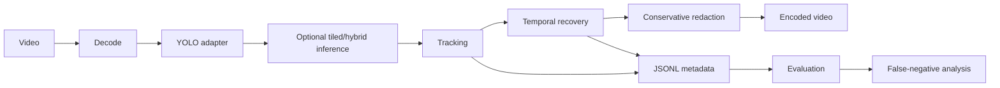

# License Plate Video Anonymizer

**Recall-first video anonymization using detection, tracking, temporal recovery, and privacy-oriented evaluation.**

A modular Python pipeline for permanently obscuring vehicle license plates in real-world video, including difficult cases such as small/distant plates, motion blur, partial visibility, oblique angles, low light, and temporary detector misses.

> **Performance status:** recall >=99% and precision >=95% are acceptance **targets**, not measured claims. The repository intentionally does not invent benchmark results.

## Architecture



The implementation separates detection, tiling, tracking, temporal logic, redaction, video I/O, metadata, evaluation, and benchmarking so components can be tested or replaced independently.

## Features

- Swappable detector interface and optional Ultralytics YOLO adapter
- Full-resolution detection plus CLI-selectable overlapping tiled/hybrid inference
- Deterministic IoU tracker baseline integrated into the video pipeline
- Bounded frame buffering with short-gap temporal interpolation before frames are written
- Blur, pixelation, or solid redaction with configurable conservative box padding
- Local video processing with original width/FPS retained by the OpenCV writer; optional FFmpeg audio remux
- JSONL detection metadata
- Traditional IoU plus privacy-oriented ground-truth coverage metric
- Frame-aware evaluation building blocks and difficult-case tags
- Throughput, realtime-factor, and user-supplied GPU-cost calculations
- CPU-only unit tests and GitHub Actions CI
- Dockerfile and explicit model/license documentation

## Install

Python 3.11+:

```bash
python -m venv .venv
# Windows: .venv\Scripts\activate
# macOS/Linux: source .venv/bin/activate
pip install -e ".[dev,yolo]"
```

FFmpeg is recommended for production media inspection/muxing even though the current writer uses OpenCV.

## Anonymize

Supply license-plate-specific weights whose license is appropriate for your use:

```bash
plate-anonymizer anonymize \
  --input input.mp4 \
  --output outputs/redacted.mp4 \
  --model models/plate_detector.pt \
  --device cuda \
  --confidence 0.15 \
  --image-size 1280 \
  --box-padding 0.15 \
  --redaction blur
```

Detection metadata defaults to the output filename with a `.jsonl` suffix.

## Evaluation

The core evaluator supports one-to-one matching with either IoU or plate-coverage scoring. The privacy coverage ratio is:

```text
intersection(predicted redaction, ground-truth plate) / area(ground-truth plate)
```

A conservative box can therefore be recognized as protecting a plate even when traditional IoU is lower. Annotation tags include `small`, `very_small`, `motion_blur`, `partial`, `occluded`, `angled`, `night`, `unreadable`, and `edge_of_frame`.

See [Evaluation Protocol](docs/EVALUATION_PROTOCOL.md) and [Annotation Guide](docs/ANNOTATION_GUIDE.md).

For the simple box-list CLI:

```json
[
  {"bbox": [100, 100, 220, 145]},
  {"bbox": [400, 300, 520, 350]}
]
```

```bash
plate-anonymizer evaluate --predictions predictions.json --ground-truth ground_truth.json --metric coverage --threshold 0.95
```

## Benchmark calculation

Once a real run has been timed:

```bash
plate-anonymizer benchmark --frames 108000 --source-fps 30 --processing-seconds 900 --gpu-hour-cost 0.50
```

Cloud pricing is never hardcoded; cost is derived from the price supplied by the user.

## Test

```bash
pip install -e ".[dev]"
ruff check .
pytest
```

## What still requires real footage

A portfolio-quality engineering implementation is not evidence of 99% recall. Before any production claim, representative footage must be manually annotated, split into development and locked holdout data, and evaluated across difficult conditions. Every false negative should be inspected.

The integrated tracker/interpolation path is a deterministic baseline. A deployment targeting extremely high recall should compare stronger tracking/temporal methods and tune them on development data without contaminating the holdout. See [Production Validation Checklist](docs/PRODUCTION_CHECKLIST.md).

## Model licensing

Weights are not bundled. See [Models and Licenses](docs/MODELS_AND_LICENSES.md). Do not redistribute or commercially deploy a checkpoint until its own license and the inference library license have been reviewed.

## Privacy

Processing is local; frames are not sent to third-party APIs. Automated anonymization must be validated before it is relied upon for privacy-sensitive datasets.

## License

Project source code: MIT. Third-party models and libraries retain their own licenses.
