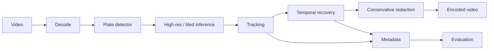

# License Plate Video Anonymizer

**Recall-first video anonymization using detection, tracking, and temporal recovery.**

This project is building a reproducible Python pipeline for permanently obscuring vehicle license plates in real-world video, including difficult cases such as small/distant plates, motion blur, partial visibility, oblique angles, low light, and temporary detector misses.

> **Performance status:** recall >=99% and precision >=95% are acceptance **targets**, not current claims. Results will only be reported after measurement on a representative, manually annotated holdout dataset.

## Why video, not frame-by-frame detection?

A detector can miss a plate for one or two frames even when neighboring frames contain strong detections. The planned pipeline combines detection with tracking, temporal recovery, conservative redaction, and high-resolution/tiled inference to reduce privacy-critical false negatives.



## Current foundation

Phase 1 establishes the typed domain models, replaceable detector interface, bounding-box geometry, privacy-oriented plate coverage metric, CLI skeleton, unit tests, CI, and evaluation/annotation documentation.

Planned commands:

```bash
plate-anonymizer anonymize --input input.mp4 --output redacted.mp4
plate-anonymizer evaluate
plate-anonymizer benchmark
```

The anonymization, evaluation, and benchmark commands are intentionally not presented as complete yet.

## Evaluation philosophy

Conventional IoU-based precision/recall will be reported alongside a privacy-oriented **plate coverage ratio**:

```text
intersection(predicted redaction, ground-truth plate) / area(ground-truth plate)
```

This matters because a conservative redaction can fully protect a plate while having imperfect traditional IoU. False negatives will remain directly inspectable and results will be broken down across difficult conditions.

See [Evaluation Protocol](docs/EVALUATION_PROTOCOL.md) and [Annotation Guide](docs/ANNOTATION_GUIDE.md).

## Development

Requires Python 3.11+.

```bash
python -m venv .venv
# Windows: .venv\Scripts\activate
# macOS/Linux: source .venv/bin/activate
pip install -e ".[dev]"
pytest
ruff check .
```

## Roadmap

- Phase 1: foundation, geometry, CLI, tests and CI
- Phase 2: detector adapter, video I/O, redaction and metadata
- Phase 3: tiled/high-resolution inference
- Phase 4: multi-object tracking
- Phase 5: temporal recovery
- Phase 6: reproducible evaluation and failure inspection
- Phase 7: GPU/CPU benchmarking and cost estimation
- Phase 8: polished documentation and demo workflow

## Privacy

The intended pipeline runs locally and does not require uploading video frames to third-party APIs. Automated anonymization must be validated on representative footage before being relied on for privacy-sensitive datasets.
