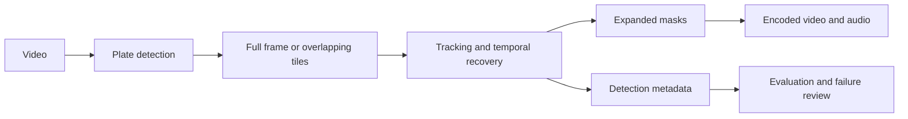

# License Plate Video Anonymizer

Detect and obscure vehicle license plates in video with a local Python pipeline.
The project combines plate detection, tracking, short-gap recovery and permanent
pixel redaction, with tools for evaluating both detection quality and coverage
continuity.

## Features

- Plate-specific YOLO detection with full-frame, tiled and hybrid inference.
- IoU tracking and an optional experimental motion tracker.
- Bounded temporal recovery to reduce short interruptions in coverage.
- Solid masks, blur or pixelation, with configurable padding.
- MP4 output with H.264 video and source audio converted to AAC.
- JSONL metadata that distinguishes detections, interpolation and propagated boxes.
- Frame-level evaluation, condition-specific recall, missed-plate crops and
  continuity metrics for manually labelled tracks.
- CPU execution, optional CUDA, reproducible examples and automated tests.

## How it works



Frames are decoded at their source resolution. The detector locates candidate
plates, tracking links observations over time, and the renderer obscures selected
pixels before encoding. The optional motion tracker can maintain a mask through
brief detector dropouts. Its predictions expire rather than extending themselves
indefinitely.

## Get started

Python 3.11 or newer:

```bash
python -m venv .venv
# Windows: .venv\Scripts\activate
# Linux/macOS: source .venv/bin/activate
python -m pip install -e ".[dev,yolo,media]"
python scripts/download_model.py
plate-anonymizer anonymize --input input/clip.mp4 --output output/redacted.mp4 --model models/plate_detector.pt --device cpu --redaction solid --preserve-audio
```

On Windows, `.\run.cmd "C:\videos\clip.mp4"` provides a shortcut.
The model downloader verifies a recorded SHA256. Other plate-specific weights
can be supplied with `--model`. Generic object-detection weights without a plate
class are rejected. See [installation](docs/setup.md) and
[model provenance](models/README.md).

The default tracker is IoU. To try bounded motion propagation, add
`--tracker-mode motion --motion-max-gap-seconds 0.2`.
For tiled detection, add `--inference-mode hybrid --tile-size 512 --tile-overlap 0.25`.
These options require evaluation on the intended footage; more detections do not
automatically mean better accuracy. See [tracking](docs/motion-tracking.md).

## Evaluate results

Run the included synthetic example without model weights:

```bash
plate-anonymizer evaluate-video --predictions examples/predictions.jsonl --ground-truth examples/ground_truth.json --report output/example-report.json
```

Expected: **1 true positive, 1 false positive and 1 false negative**.
This is an evaluator fixture, not a model benchmark.

To measure mask coverage on labelled footage:

```bash
plate-anonymizer evaluate-video --predictions output/redacted.jsonl --ground-truth data/labels.json --report output/coverage-report.json --metric coverage --threshold 0.95 --box-field redaction_bbox --video input/clip.mp4 --failure-dir output/missed-plates
```

Labels must explicitly identify reviewed frames, including empty ones. Stable
ground-truth track IDs enable uncovered-frame counts and longest-gap measurements.
See the [annotation guide](docs/annotation-guide.md) and
[evaluation protocol](docs/evaluation.md).

## Validation status

Two street-video runs completed with output frame counts, resolution, nominal FPS
and audio checked. A controlled motion-tracking regression also verifies recovery
of a six-frame detection gap.

| Run | Input | CPU processing |
| --- | --- | --- |
| Street clip A | 30 seconds, 750 frames, 1280 x 720, 25 FPS | 371.81 seconds, excluding final H.264/audio pass |
| Street clip B | 60 seconds, 1,800 frames, 848 x 478, 30 FPS | 757.97 seconds, including final H.264/audio pass |

The timing scopes differ, so these are run records rather than a speed comparison.
Visual review found missed plates, intermittent coverage and false-positive masks.
Recall, precision and GPU throughput have not been measured on a labelled holdout.
The project does not claim 99% recall. [Validation details](docs/validation.md).

## Development

```bash
python -m ruff check .
python -m pytest
```

GitHub Actions is configured for Windows and Linux with Python 3.11 and 3.13.
The local suite contains 40 tests covering geometry, tracking, propagation,
evaluation, media handling and CLI behavior.

## Documentation

- [Setup and reproducibility](docs/setup.md)
- [Architecture and limitations](docs/architecture.md)
- [Motion tracking and comparisons](docs/motion-tracking.md)
- [Annotation format](docs/annotation-guide.md)
- [Evaluation methodology](docs/evaluation.md)
- [Validation records](docs/validation.md)
- [Roadmap and performance planning](docs/roadmap.md)
- [Release validation checklist](docs/production-checklist.md)

## Scope and licensing

Long recordings, 4K, night footage, H.265/MOV decoding, variable frame-rate timing
and CUDA throughput require further validation. Motion propagation is experimental
and can drift; it cannot recover a plate never detected. Processing is local;
footage, generated outputs and model binaries are excluded from version control.

Project source is [MIT licensed](LICENSE). Third-party models and libraries retain
their own terms; see [licensing notes](docs/models-and-licenses.md).
