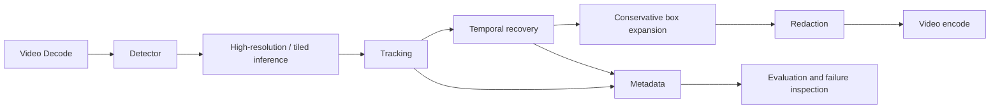

# Architecture

The project is deliberately recall-first: a missed plate is a privacy failure.

## Planned pipeline

Detector, tracker, temporal recovery, redaction, video I/O, and evaluation are kept as separate components so they can be tested and replaced independently.

No 99% recall claim is made by this repository until it is measured on a locked, representative, manually annotated holdout set.
